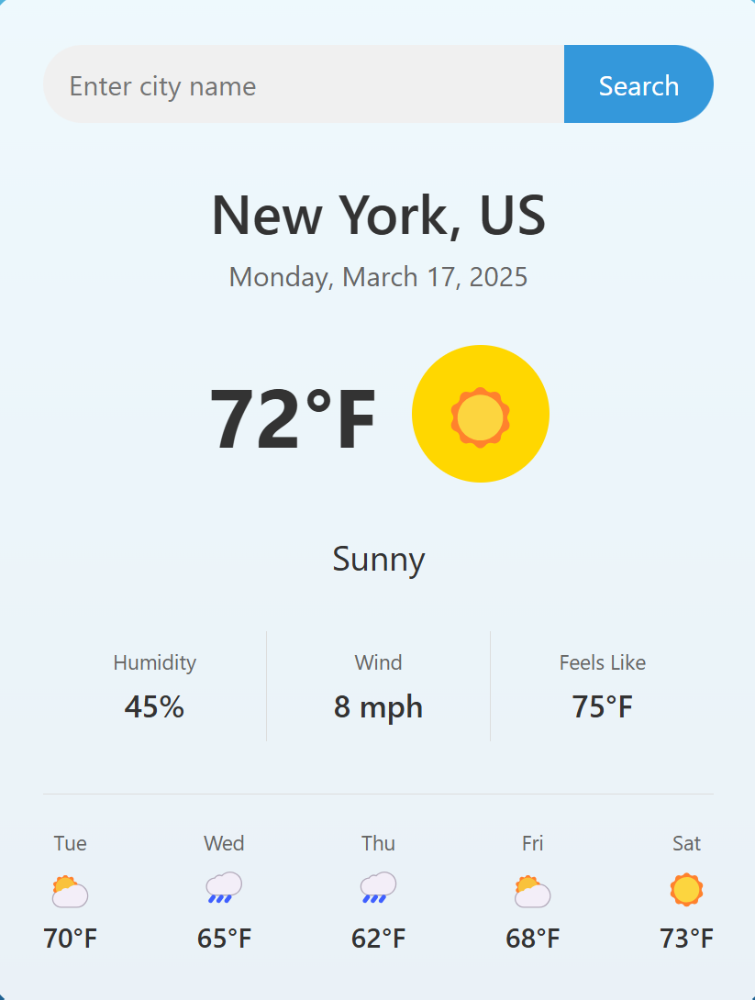
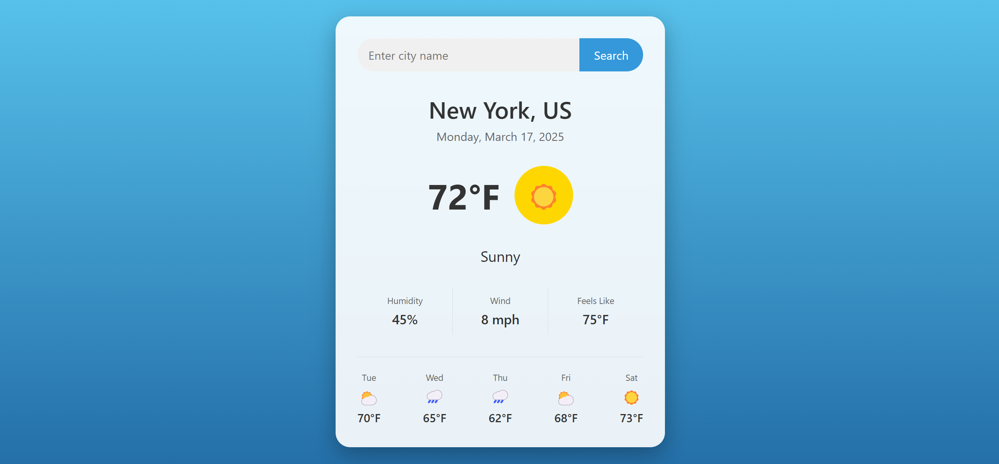

# SkyCast

## Overview

SkyCast is a weather forecasting application that provides accurate and up-to-date weather information for any location.

## Features

- Current weather conditions
- 7-day weather forecast
- Weather alerts and notifications
- Interactive weather maps

## Installation

1. Clone the repository:
   ```bash
   git clone https://github.com/yourusername/SkyCast.git
   ```
2. Navigate to the project directory:
   ```bash
   cd SkyCast
   ```

## Usage

1. Open `index.html` in your web browser.
2. Enter the location for which you want to get the weather forecast and click "Search".

## Files

- `index.html`: The main HTML file for the application.
- `style.css`: The CSS file for styling the application.
- `script.js`: The JavaScript file for fetching and displaying weather data.

## images





## Contributing

Contributions are welcome!
